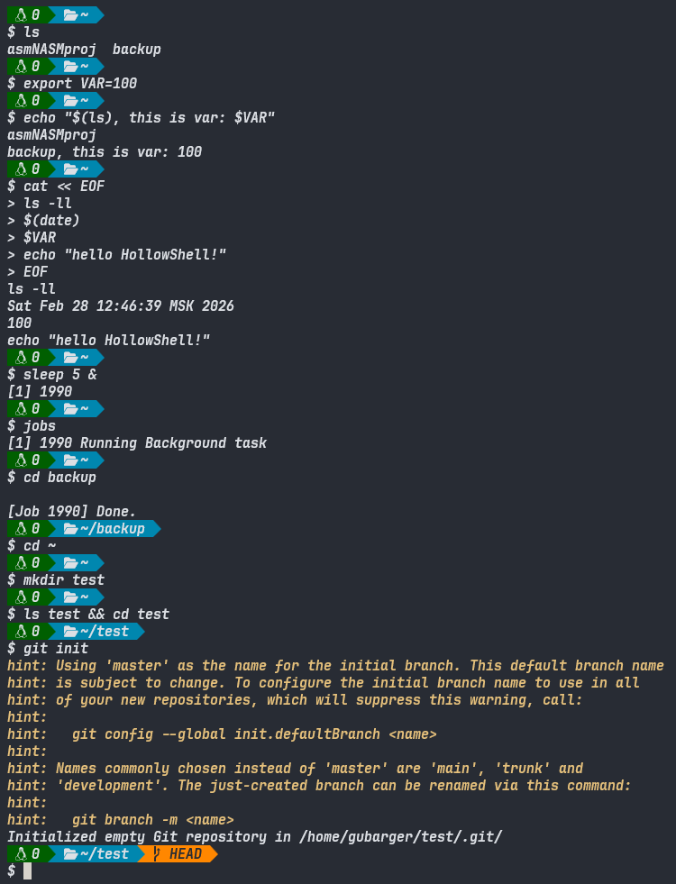
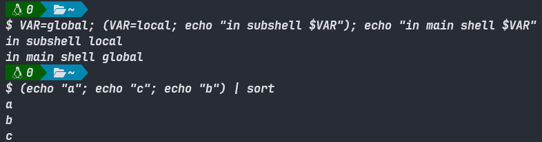

# Overview
HollowShell is a POSIX-compliant shell that implements the classic cycle: **read -> parse -> execute**.



---



---

> [!IMPORTANT]
> The order of substitutions matters: command substitution (`$(...)`) occurs **before**
> variable substitution, so that the command result can contain variables for
> further expansion.

## Builtin Commands

| Command | Function | Description |
|:-----------|:------------------|:----------------------------------------|
| `cd` | `BuiltinCD()` | Change directory with support for `cd -`, `cd ~` |
| `exit` | `BuiltinEXIT()` | Exit with a return code |
| `help` | `BuiltinHELP()` | Help on built-in commands |
| `true` / `:` | `BuiltinTRUE()` | Returns `0` |
| `false` | `BuiltinFALSE()` | Returns `1` |
| `exec` | `BuiltinEXEC()` | Replace the current process |
| `export` | `BuiltinEXPORT()` | Export variables to the environment |
| `jobs` | `BuiltinJOBS()` | List of background tasks |

---

## Token Table

| Token | Type | Example | Description |
|:-------|:-------------------|:-------------------|:-----------------------------|
| _word_ | `WORD` | `ls` | Command, argument, filename |
| `|` | `PIPE` | `cmd1 | cmd2` | Pipeline |
| `||` | `OR` | `cmd1 || cmd2` | Logical OR |
| `&&` | `AND` | `cmd1 && cmd2` | Logical AND |
| `&` | `BACKGROUND` | `cmd &` | Background run |
| `<` | `REDIRECT_IN` | `cmd < file` | Input redirection |
| `>` | `REDIRECT_OUT` | `cmd > file` | Output redirection |
| `>>` | `APPEND_OUT` | `cmd >> file` | Append to file |
| `2>` | `REDIRECT_ERR` | `cmd 2> err` | Redirect stderr |
| `&>` | `REDIRECT_BOTH` | `cmd &> out` | stdout + stderr to one file |
| `<<` | `HEREDOC` | `cmd << EOF` | Here document |
| `<<<` | `HERE_STRING` | `cmd <<< "text"` | Here string |
| `<>` | `REDIRECT_RW` | `cmd <> file` | Read + write |
| `>&` | `REDIRECT_DUP` | `2>&1` | Duplicate descriptor |
| `;` | `SEMICOLON` | `cmd1; cmd2` | Command separator |
| `(` | `LPAREN` | `(cmd)` | Start of subshell |
| `)` | `RPAREN` | `(cmd)` | End of subshell |

---

## Prompt Display
The prompt displays the return code of the last command, the current directory, and the Git branch (if any).

**Successful execution (code `0`).**

## Implementation Notes

1. Memory Management — uses std::unique_ptr for AST nodes,
which ensures that there are no leaks in any execution path.

2. Signal Handling — the shell ignores SIGINT / SIGTSTP; child processes restore default handling before executing.

3. Background Processes — added to the jobs list; zombies are collected
in each cycle using waitpid(-1, ..., WNOHANG).

4. Command Substitution — commands in $(...) are executed via /bin/sh for simplicity.

> [!WARNING]
> The current implementation of command substitution via `/bin/sh` means that the system shell is used internally
> `$(...)`, not HollowShell. This may
> lead to behavioral differences. A future implementation is planned to replace this with
> a recursive call to the custom `Executor`.

# Building
```bash
# Debug
cmake --preset=debug
cmake --build --preset=debug
./build/debug/HollowShell/hollow_shell

# Release
cmake --preset=release
cmake --build --preset=release
./build/debug/HollowShell/hollow_shell
```